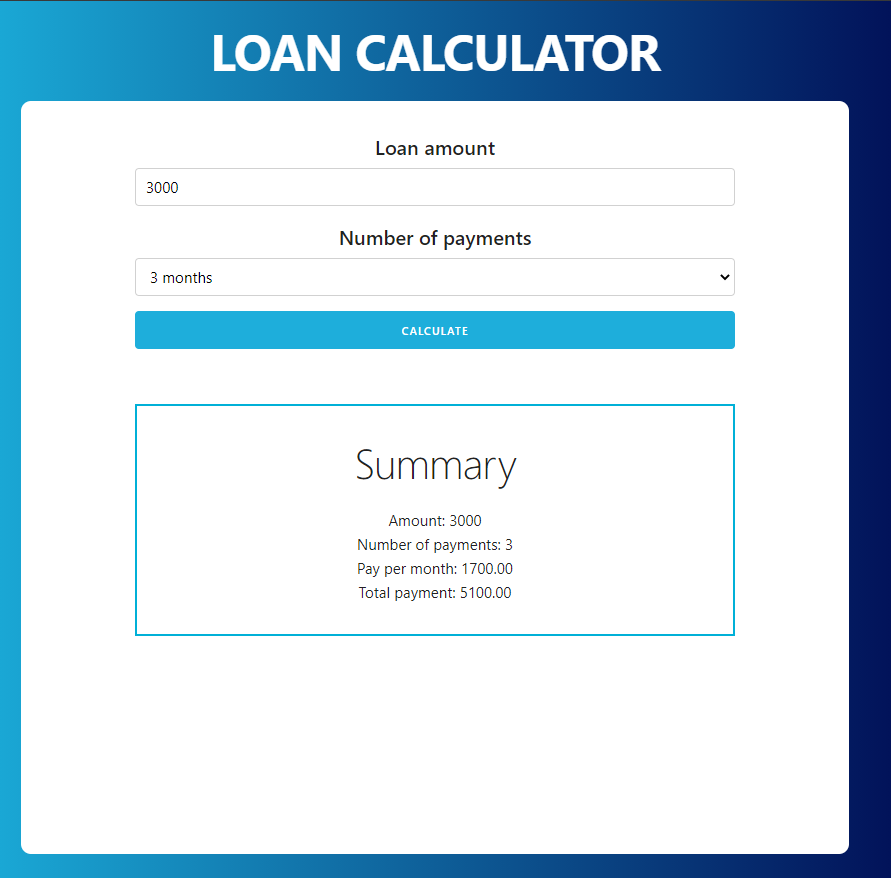

# Loan Calculator
The project consits in an small application for calculating loans according to the user's input.

It has been developed in the Modern JavaScript definitive guide course from Udemy. 

